# Arquitectura funcional del proyecto Gran Prix CapyTown

```mermaid
flowchart LR
    %% Entradas
    LIDAR([LiDAR MS200<br/>/scan])
    CAM([Cámara frontal<br/>/camera/image_raw])
    ODOM([Odometría<br/>/odom_raw])

    %% Percepción geométrica
    subgraph PER[1. Percepción geométrica]
        LP["lidar_processor_node.py<br/><b>_on_scan()</b><br/>Corrige el marco del LiDAR,<br/>divide el escaneo en sectores<br/>y publica /lidar_zones"]
        FIT["lidar_utils.py<br/><b>fit_wall_line()</b><br/>Convierte puntos polares a cartesianos,<br/>ajusta la pared por mínimos cuadrados<br/>y rechaza puntos atípicos"]
    end

    %% Control
    subgraph CTRL[2. Control de pared]
        WF["wall_follower_node.py<br/><b>WallFollowerNode._on_zones()</b><br/>Calcula error angular y de distancia,<br/>aplica ω = sat(Kα·α + s·Kd·ed)<br/>y publica una sugerencia Twist"]
    end

    %% Percepción visual
    subgraph VIS[3. Percepción visual]
        DET["stop_sign_detector_node.py<br/><b>_DetectorColor.procesar()</b><br/>Segmenta rojo en HSV, valida el contorno<br/>y confirma PARE con 3 cuadros positivos;<br/>lo elimina después de 5 pérdidas"]
    end

    %% Navegación
    subgraph FSM[4. Navegación y arbitraje — state_machine_node.py]
        INI["<b>_handle_iniciar()</b><br/>Registra A4 mirando al este<br/>y prepara el giro inicial izquierdo de 90°"]
        PAUSA["<b>_handle_pausa_giro()</b><br/>Retrocede brevemente y se detiene<br/>para obtener espacio antes de girar"]
        GIRAR["<b>_handle_girar()</b><br/>Realiza un arco Ackermann,<br/>controla el giro con el yaw<br/>y actualiza la orientación"]
        ALIN["<b>_handle_alinear()</b><br/>Compara las distancias lateral-delantera<br/>y lateral-trasera para quedar paralelo"]
        META["<b>_handle_verificar_meta()</b><br/>Compara la celda actual con F1;<br/>finaliza o inicia el siguiente tramo"]
        AV["<b>_handle_avanzar_paralelo()</b><br/>Reenvía la sugerencia de wall_follower,<br/>mide el avance y vigila la pared frontal"]
        CHK["<b>_handle_chequeo_lado()</b><br/>Cada 0,12 m comprueba si la pared<br/>izquierda continúa o se abrió"]
        FASE["<b>_avanzar_a_siguiente_fase()</b><br/>Actualiza la celda lógica, las visitas<br/>y activa la evaluación del cruce"]
        CRUCE["<b>_handle_detectar_cruce()</b><br/>Clasifica izquierda, frente y derecha<br/>mediante consenso de 3 de 5 lecturas"]
        PARE["<b>_handle_buscar_pare()</b><br/>Consulta /pare_detectado y mantiene<br/>velocidad cero durante 3 segundos"]
        DEC["<b>_handle_decidir()</b><br/>Usa BFS si existe un plan válido;<br/>si no, aplica izquierda–frente–derecha<br/>y prefiere la celda menos visitada"]
    end

    %% Posición lógica
    subgraph GRID[5. Posición lógica — grid_map.py]
        ADV["<b>GridTracker.advance_cell()</b><br/>Mueve la celda lógica una posición<br/>según el rumbo y detecta salida de rejilla"]
        TURN["<b>GridTracker.apply_turn()</b><br/>Actualiza la orientación cardinal<br/>después de completar un giro"]
    end

    %% Mapa y planificación
    subgraph MAP[6. Mapa y planificación — maze_map.py]
        REC["<b>MazeMap.record()</b><br/>Registra como aristas las conexiones<br/>libres entre celdas vecinas"]
        BFS["<b>MazeMap.shortest_headings()</b><br/>Ejecuta búsqueda en anchura y devuelve<br/>los rumbos de la ruta más corta conocida"]
    end

    %% Métricas
    subgraph LOG[7. Registro — metrics_logger_node.py]
        EVENT["<b>MetricsLoggerNode._on_event()</b><br/>Cuenta celdas, giros, callejones,<br/>PARE, alertas y llegada a meta"]
        CSV[(CSV de resultados)]
    end

    MOTOR([Actuadores<br/>/cmd_vel])

    LIDAR --> LP
    LP <--> FIT
    LP -->|/lidar_zones| WF
    LP -->|/lidar_zones| CRUCE
    LP -->|distancias laterales| ALIN
    WF -->|/wall_follow/cmd_vel_suggestion| AV

    CAM --> DET
    DET -->|/pare_detectado| PARE
    ODOM -->|posición y yaw| AV
    ODOM --> GIRAR

    INI --> PAUSA --> GIRAR --> ALIN --> META
    META -->|no llegó a F1| AV
    AV -->|cada 0,12 m| CHK
    CHK -->|pared continúa| AV
    CHK -->|abertura confirmada| FASE
    AV -->|0,55 m o pared frontal| FASE
    FASE --> CRUCE --> PARE --> DEC
    DEC -->|seguir de frente| ALIN
    DEC -->|debe girar| PAUSA

    FASE -. actualiza .-> ADV
    GIRAR -. actualiza .-> TURN
    CRUCE -. registra conexiones .-> REC
    REC -. grafo de Ronda 1 .-> BFS
    BFS -. plan de Ronda 2 .-> DEC

    AV -->|comando autorizado| MOTOR
    PAUSA --> MOTOR
    GIRAR --> MOTOR
    ALIN --> MOTOR
    PARE -->|velocidad cero| MOTOR
    META -->|META: velocidad cero| MOTOR

    INI -. /robot_event .-> EVENT
    FASE -. /robot_event .-> EVENT
    CRUCE -. /robot_event .-> EVENT
    PARE -. /robot_event .-> EVENT
    DEC -. /robot_event .-> EVENT
    META -. /robot_event .-> EVENT
    EVENT --> CSV

    classDef sensor fill:#e8f7f4,stroke:#00766b,color:#111,stroke-width:2px;
    classDef perception fill:#eaf2fb,stroke:#194e79,color:#111;
    classDef state fill:#eff9ef,stroke:#2e7d32,color:#111;
    classDef map fill:#f3ebfa,stroke:#624399,color:#111;
    classDef output fill:#fcecef,stroke:#be2d37,color:#111,stroke-width:2px;

    class LIDAR,CAM,ODOM sensor;
    class LP,FIT,WF,DET perception;
    class INI,PAUSA,GIRAR,ALIN,META,AV,CHK,FASE,CRUCE,PARE,DEC state;
    class ADV,TURN,REC,BFS map;
    class MOTOR,EVENT,CSV output;
```

## Lectura rápida

1. `lidar_processor_node.py` convierte el escaneo crudo en distancias por sectores y rectas laterales.
2. `wall_follower_node.py` calcula la sugerencia de movimiento para mantener la pared izquierda a aproximadamente 0,12 m.
3. `stop_sign_detector_node.py` procesa la cámara y publica si existe una señal de PARE confirmada.
4. `state_machine_node.py` decide cuándo avanzar, detenerse, girar, alinearse o finalizar; es el único que autoriza el comando final hacia `/cmd_vel`.
5. `grid_map.py` mantiene la celda y orientación estimadas.
6. `maze_map.py` construye el grafo durante la exploración y aplica BFS en la segunda ronda.
7. `metrics_logger_node.py` registra los eventos y genera el archivo CSV.

